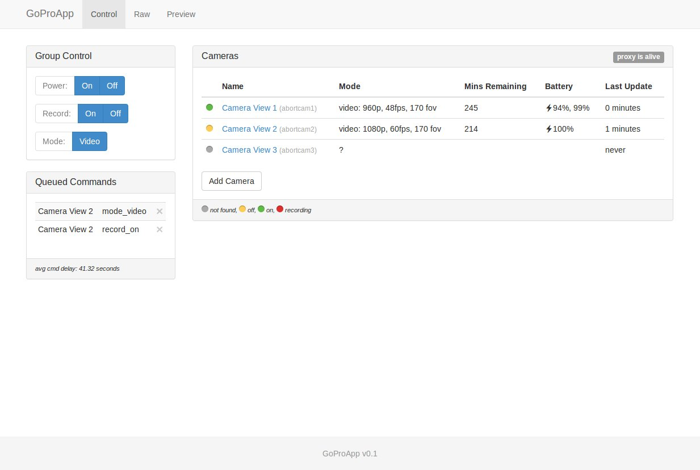
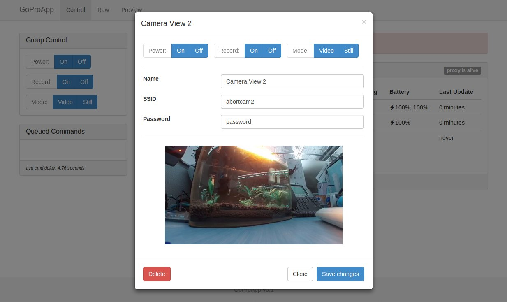

GoProApp
================

Controls multiple GoPros from a web page.

This is a reusable Django app that provides a front end for the [GoProController](https://github.com/joshvillbrandt/GoProController) python class. The app itself is built off of [django-quick-start-app](http://github.com/joshvillbrandt/django-quick-start-app).

# How it works

The backbone of GoProApp is a program called GoProProxy that runs asynchronously to the server. This proxy periodically grabs the status of every camera in the database and sends commands to cameras when appropriate. GoProProxy utilizes GoProController to do the dirty work of actually communicating to the cameras.

The website portion of GoProApp grabs the latest status data from the database and serves it to the user. It also saves command requests back to the database when generated by the user.

# Setup

This app depends on python-dateutil. If you don't have that installed already:

    sudo apt-get install python-dateutil

To use this app, you must have a Django project already set up. Try out [django-quick-start-project](http://github.com/joshvillbrandt/django-quick-start-project) for an easy start.

    django-admin startproject --template=https://github.com/joshvillbrandt/django-quick-start-project/archive/master.zip --extension=py,html GoProSite

Then add this app to the site.

    cd GoProSite
    git clone https://github.com/joshvillbrandt/GoProApp.git

Once you have added the app, add it to your INSTALLED_APPS list in your projects settings.py file.

    'GoProApp',

Then add a line to include the GoProApp urls.py file in your projects urls.py file like this:

    url(r'^', include('GoProApp.urls', namespace="GoProApp")),

Then run `python manage.py syncdb` to install the models and launch runserver to see the site in action.

To actually be able to talk to the cameras, you also need to start the GoProProxy.py script. The script continuously polls the cameras for their statuses and sends commands to the cameras as they are queued up in the server. GoProProxy expects [GoProController](https://github.com/joshvillbrandt/GoProController).py to be in your project directory. Once it is there, cd to your project directory and launch the proxy like this:

    python GoProProxy.py

# Todo

* add upstart config for GoProProxy
* run server via apache

# Screenshots

