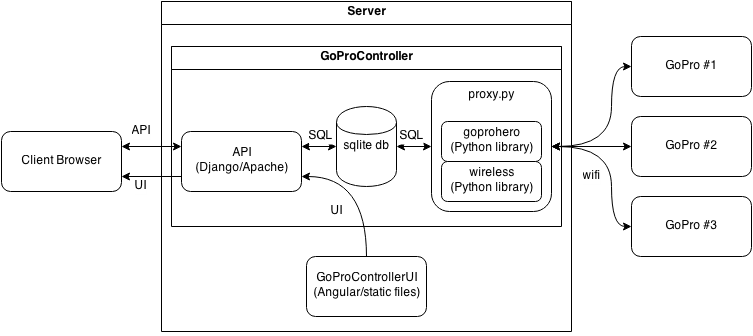

# GoProController

An http API to control multiple GoPro cameras over wifi.

## Description

This program can be used to control multiple GoPro cameras via the [goprohero](https://github.com/joshvillbrandt/goprohero) Python library. When ran from a Linux machine with compatible wireless card, this program is capable of automatically negotiating between the different ad-hoc wireless networks that each cameras makes.

A user interface is available for this API as a standalone package. See [GoProControllerUI](https://github.com/joshvillbrandt/GoProControllerUI).

## How it works

The backbone of GoProApp is a program called `GoProProxy` that runs asynchronously to the server. This proxy periodically grabs the status of every camera in the database and sends commands to cameras when appropriate. The proxy uses [wireless](https://github.com/joshvillbrandt/wireless) to jump between networks and [goprohero](https://github.com/joshvillbrandt/goprohero) to handle the communication to the cameras. A Django app is used to persist data from the proxy and serve API endpoints.



Note: The xml version of the above diagram can be modified with [https://www.draw.io/](https://www.draw.io/).

## Production Setup (Ubuntu)

First, download the code:

```bash
git clone https://github.com/joshvillbrandt/GoProController.git ~/GoProController
sudo ln -s ~/GoProController /home/GoProController
```

If you are running Ubuntu, use the `setup.sh` script to automatically set up the application in a production mode:

```bash
sudo /home/GoProController/setup.sh
```

Upon completion of `setup.sh`, you should now be able to navigate to [http://localhost/](http://localhost/) and see the API. In addition, the `GoProApp/proxy.py` file is also now running continuously to the local wifi adapter and communicate with the cameras.

You can interact with the server and proxy using `service` and `initctl`:

```bash
sudo service apache2 status
sudo initctl status gopro-proxy
```

Logs for both are also available:

```bash
tail /var/log/apache2/error.log
tail -f /var/log/gopro-proxy.log
```

To set a specific interface for wifi control, add the following to [upstart.conf](upstart.conf):

```
env GOPRO_WIFI_INTERFACE=wlan1
```

## Development Setup (Ubuntu, Mac)

To run GoProApp without Apache and Upstart, launch the site with the Django development server:

```bash
git clone https://github.com/joshvillbrandt/GoProController.git ~/GoProController
cd ~/GoProController
sudo python setup.py install
python manage.py runserver 0.0.0.0:8000
```

In another terminal window, launch the proxy to communicate with the cameras:

```bash
sudo python ~/GoProController/proxy.py # sudo needed for logging (or add yourself to syslog in Ubuntu)
```

You should now be able to navigate to [http://localhost:8000/](http://localhost:8000/) and see the API.

To set a specific interface for wifi control, add the following environment variable before the proxy command:

```bash
sudo GOPRO_WIFI_INTERFACE='wlan1' python ~/GoProController/proxy.py
```

## API

This API provides the following endpoints:

Endpoint | Actions
--- | ---
`/cameras` | GET, POST
`/cameras/:id` | GET, PUT
`/commands`| GET, POST
`/commands/:id` | GET, PUT

The API if build on the [Django REST Framework](http://www.django-rest-framework.org/). Please reference their documentation for detailed querying information.

## Change History

This project uses [semantic versioning](http://semver.org/).

### v0.2.4 - 2015/01/29

* Added `GOPRO_SNAPSHOTS` environment flag to turn off grabbing snapshots images if desired
* The proxy now fails commands when it can't find the camera instead of leaving them in the queue to block everybody else
* Added [spammer.py](spammer.py) - try `sudo goprospammer -p record -v on`
* Added [logger.py](logger.py) - try `goprologger -d output`

### v0.2.3 - 2015/01/14

* Updated `goprohero` and `wireless` library versions

### v0.2.2 - 2015/01/06

* Pagination is now supported; try `?page=1&limit=20`
* Basic sorting/ordering is now supported; try `?ordering=-date_added`
* Fixed a schema bug that prevented commands without values from being saved (commands like `delete_all` and `delete_last`)

### v0.2.1 - 2014/12/03

* Updated for library change from `gopro` to `goprohero`
* Fixed bugs in `setup.sh`
* Moved API root to `/api` when using the Apache config
* Added the `/api/config` endpoint
* Added support to serve [GoProControllerUI](https://github.com/joshvillbrandt/GoProControllerUI) static content at `/`

### v0.2.0 - 2014/11/24

* Renamed project from `GoProApp` to `GoProController`
* Refactored user interface out of the project and into [GoProControllerUI](https://github.com/joshvillbrandt/GoProControllerUI)
* Now contains a RESTful API for cameras and commands

### v0.1.1 - 2014/09/11

* Bug fixes

### v0.1.0 - 2013/10/31

* Initial release

## Known Issues

There is a memory leak that will cause the program to crash after a couple hours of use with two or more cameras. (It will crash quicker with just one camera since the program runs quicker without network hops.) I've spent a few hours trying to track down the issue to no avail. It seems as though there are uncollectable objects from both the Django side and the GoPro/urllib2 side. I tried replacing urllib2 with python-requests/urllib3, but that didn't help. I used [gc](https://docs.python.org/2/library/gc.html) and [objgraph](http://neverfear.org/blog/view/155/Investigating_memory_leaks_in_Python) to help debug.

## Contributions

Pull requests to the `develop` branch are welcomed!
